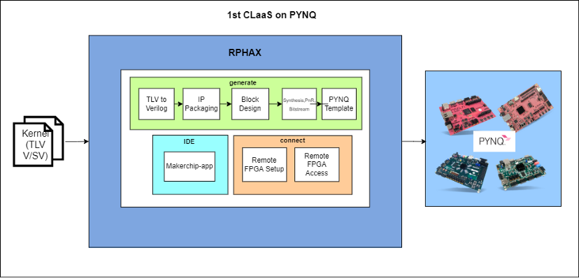
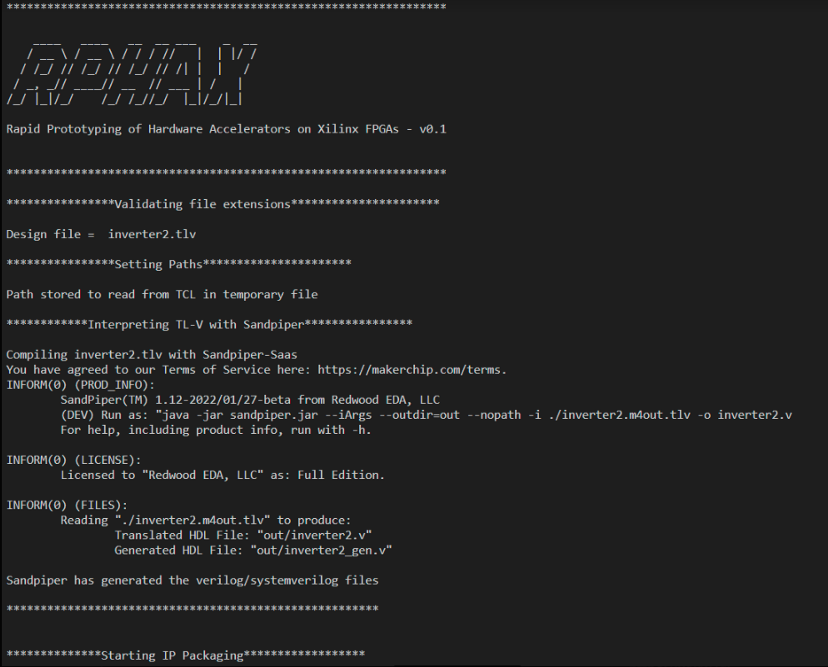
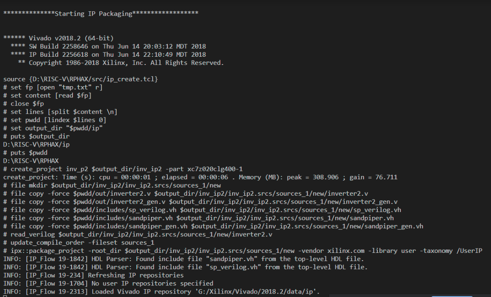
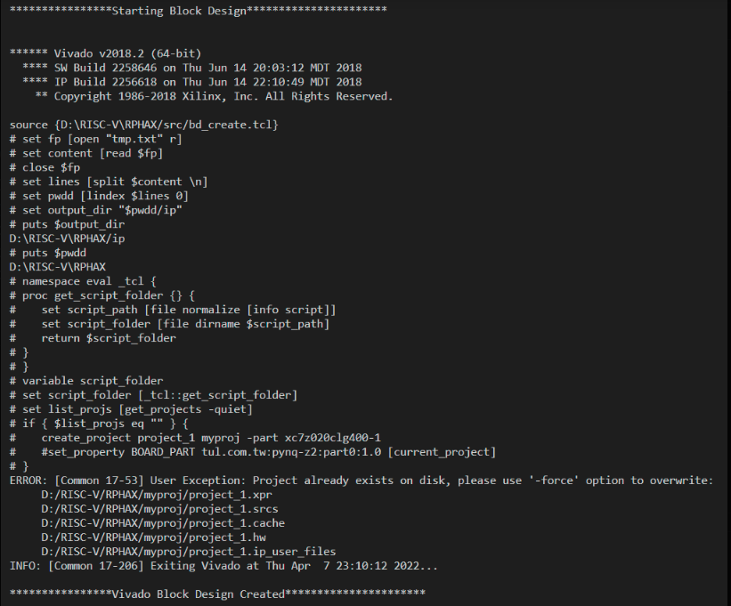
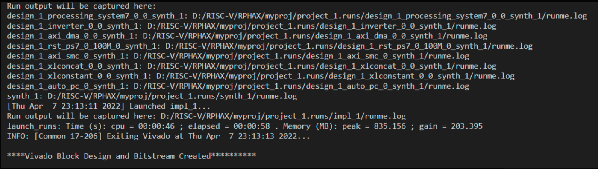

# 1st CLaaS on PYNQ
1st CLaaS on PYNQ, brings the use model of [1st CLaaS](https://github.com/os-fpga/1st-CLaaS), a framework for accelerating workloads with FPGAs on Cloud, by streaming data through web-protocols to [PYNQ](https://pynq.readthedocs.io/en/latest/) FPGAs, but with the capabilities of RPAHX (Rapid Prototyping of Hardware Accelerators on Xilinx FPGAs), an automation framework to quickly prototype a hardware accelerator and integrate on a Zynq/Microblaze based design on Xilinx FPGAs.
The framework also has automated scripts to setup and securely expose your local FPGA to the internet, through Cloudflare Zero Trust on your own domain!  

# RPHAX - Rapid Prototyping of Hardware Accelerators on Xilinx FPGAs 

RPHAX provides a quick automation flow to develop and prototype hardware accelerators on Xilinx FPGAs.  The user can develop the Hardware Accelerator in TL-Verilog/Verilog/System Verilog and use this flow to automatically package into an IP(AXI4, AXI4Lite, AXI Stream), create a Zynq based block design, top level wrappers and generate the bitstream.



## Requirements

- Xilinx Vivado 2018.1/2
    - Download Xilinx Vivado 2018.1 or 2018.2 from the [website](https://www.xilinx.com/support/download/index.html/content/xilinx/en/downloadNav/vivado-design-tools/archive.html)
    - As vivado versions are not completely backward compatible in the TCL mode, 2018.1 and 2018.2 would work out of the box, with the framework. If you are using the latest version and you are interested in supporting it, feel free to fork the repo and modify the [tcl scripts](./src), with the the equivalent TCL Commands that work in the latest version. View Contributing guidelines for more details

- If you are using [TL-Verilog](https://www.redwoodeda.com/tl-verilog) then [Sandpiper - SaaS](https://gitlab.com/rweda/sandpiper-saas), a TL-Verilog interpreter as a microservice on cloud is required. Install the python package

    - ```pip install sandpiper-saas```

- If you are using the `makerchip` mode in RPHAX, then install Makerchip-app 
    - ```pip install makerchip-app```
    
## Getting Started 

- Clone the repo 

```git clone https://github.com/shariethernet/RPHAX.git```

- To get help at any point

```python rphax.py -h```
- There are three different modes, and you can begin the development based on the requirement
    - `generate` - This is the main mode, that is used to integrate interfaces, automate IP Packaging, Generation of Block Design, top level wrappers and bitstream. This constitutes the main functionality of the framework
    - `connect` - This is used to setup cloudflare tunnels on your Local FPGA, and expose your FPGA to the internet on your own domain, if the DNS is managed by Cloudflare. This heavily uses Cloudflare API, and requires you to have a cloudflare account. It is recommended that you have a separate domain, with cloudflare keys configured with access only to the intended domain
    - `makerchip-app` - This framework integrates the versatile [Makerchip IDE](https://makerchip.com), which allows you to design your logic in TL-Verilog/Verilog/System Verilog, simulate it, view waveforms and even visualize it. Use [Virtual FPGA Lab](https://github.com/os-fpga/Virtual-FPGA-Lab), if you intend to simulate your designs on a Virtual FPGAs

### Generate Mode

- Run the python script

```python rphax.py generate [-b] Filename ```

- On the first run, `runs` folder will be created. For every run a unique directory `run_projectname_hhmmss` will be created. All outputs will be present in this directory. 
- The `ip` directory contains the kernel packaged as an AXI Stream IP with 1 Master and 1 Slave ports
- The `run_bd` directory contains the generated Zynq based block design for the IP.
- To add your own custom design refer [examples](/examples) or create your own depending on the given example.

#### Flags
- When `-b` flag then the bitstream will also be generated. However, for new designs, it is preferred to genrate till blockdesign and proceed with the GUI for generating bitstream to catch any errors. 
- Use `-py` pr `--pynq` to connect to your pynq board
- Use `-u Your URL` to specify the URL of the pynq board. Defaults to _https://pynq:8080_ 
- Use `-h` flag to get help

_Support to be added to automatically upload Hardware Handoff and Bitstream to PYNQ Board_

#### Working 

- Generate RTL (Verilog/System Verilog) from TL-Verilog 



- Packaging RTL to IP based on the interface template



- Generating Zynq based block design 



- Generating Top Level wrapper and Bitstream



Rename the bitstream and hardware handoff to the same name and upload to the jupyter notebook. Write Python overlay based on the template to accelerate specific functions.

To know more stay tuned for the training on **PYNQ based FPGA Design**.

Refer examples and [PYNQ-Overlay Documentation](https://pynq.readthedocs.io/en/latest/overlay_design_methodology.html), to learn about developing overlays

### Connect Mode

``` python rphax.py connect ```

- The connect mode has been provided as an external [script](./rphax_connect_test/rphaxFPGAConnect.py)
- The connect framework automates [cloudflared](https://github.com/cloudflare/cloudflared) on your PYNQ FPGA, running Linux. 
- Uses Cloudflare API, to setup allocate and deallocate CNAME Records on your Domain's DNS.
- Requires Cloudflare Account, Domain and a Token
- The default domain name is `u.<no_of_fpga>_pynq.<your_domain>.com`. This can be edited
- DO NOT use this script on any domain in use, unless you know what you are doing

### Manual setup
- Read [this](./docs/CloudflareSetuponPYNQManual.pdf) pdf which provides a step by step guide on cloudflared setup on PYNQ

### Makerchip Mode

Syntax

```rphax.py makerchip [--makerchip_args MAKERCHIP_ARGS] design```

A wrapper that opens your local design in Makerchip-app. You can append makerchip arguments to the command. See Makerchip-app for more details
 

#### Flags
- Use `--from_url` to open a .tlv project specified by the URL
- Use `--server` to specify a specific makerchip server. Defaults to `app.makerchip.com` 
- Use `--maherchip_args` to append arguments to makerchip app


## Overlays

Refer [examples](./examples_wrapped) for the custom python overlay. Several TL-Verilog examples have been provided in both the wrapped form ready to use in this framework, as well as in the unwrapped form to enable you get your hands-on with TL-Verilog. But this framrwork does not mandate the use of TL-V, Verilog/System verilog examples have been provided. 

### Examples
- [Streaming Adder](./examples/examples_wrapped/1_adder.tlv)
- [AXI4 Lite Adder](./examples/adder.tlv)
- [Fibonacci Series](./examples/examples_wrapped/2_fibonacci.tlv)
- [Pythagoras Triplet Non-pipelined and Pipelined](./examples/examples_wrapped/3_pyth.tlv)
- [Pythoagoras Triplet with Validity](./examples/examples_wrapped/4_pyth_validity.tlv)
- [Accumulator](./examples/examples_wrapped/accumulator_1.tlv)
- [Image Inversion](./examples/inverter/)
- [Vector Add](./examples/vadd/)

### Video Walkthrough

Click on the below to view the video

[](https://www.youtube.com/watch?v=Q5B5X7CFILY "Video Demo")
## Customizing Clock Bus parameters [OPTIONAL]

All the Clock Bus prameters are pre-configured and these sub-section(s) are optional

### Using Vivado TCL 

##### Changing the Clock Frequency

- The script sets the default frequency to be `100 Mhz`. However this can be changed by placing the below TCL Command in [ip_create.tcl](src/ip_create.tcl)

 ```
set_property VALUE _your_clk_freq_in_Hz_ [ipx::get_bus_parameters -of_objects [ipx::get_bus_interfaces -of_objects [ipx::current_core]  axi_clk] FREQ_HZ]
```
##### Associating more ports with the same clock

- The `ASSOCIATED_BUSIF` parameter is used to tell which AXI Buses use which clock in a multiple clock domain design. Here we use a single clock domain and so we associated all the AXI Buses to `axis_clk`. This can be done by adding the following command in [ip_create.tcl](src/ip_create.tcl)

```
set_property VALUE m_axis:s_axis [ipx::get_bus_parameters -of_objects [ipx::get_bus_interfaces -of_objects [ipx::current_core]  axi_clk] ASSOCIATED_BUSIF]
```

- Make sure that the different buses are separated by a colon `:`

### Using GUI

- Open the VIVADO Project and from sources click on `component.xml` then right click `axi_clk` > `edit interface` > Parameters and then set the `ASSOCIATED_BUSIF`'s value to m_axis:s_axis
- Similarly set `FREQ_HZ` to `100000000` (100Mhz) 
- Repackage the IP
- Open the block design project from `myproj` and Upgrade IP
- Generate Bitstream

### Repackaging

- After making any changes in the IP. Repackage the IP. This is done automatically in the TCL Scripts
- The block design has to be upgraded. This is also done automatically in the TCL Scripts
- So every time you call `ip_create()` and `bd_create()` functions in python, the updates are checked and the latest design is used
- Alternatively, this can also be done in GUI


## Further work

- Package RPHAX, as a python library 
- YAML based template generation
- [WARP-V](./examples/examples_wrapped/warpv_rphax.tlv) (_RTL debug required_)
- [Mandelbrot](./examples/mandelbrot/mandelbrot_kernel_fpga.tlv) (_python overlay under development_)
- Documentation

## Note

- Interfaces supported
    - AXI Stream
    - AXI4 Lite
- 1 AXI stream or 1 AXI4 Lite per IP
- The hardware accelerator must have the ports named as given in the template
- In `TL-Verilog` map the pipesignals to the ports, this has been done in the examples

## Sponsors

This project was supported by [**Google Summer of Code 2022**](https://summerofcode.withgoogle.com/) under [**Free and Open Source Silicon Foundation (FOSSi)**](https://www.fossi-foundation.org/) _(as a GSoC umbrella organization)_, with mentorship from [**Redwood EDA**](https://www.redwoodeda.com/) and [**Still Water Supercomputing**](https://www.stillwater-sc.com/)

<p>
    <span>
    <span>&nbsp;&nbsp;&nbsp;&nbsp;&nbsp;</span>
    <span>&nbsp;&nbsp;&nbsp;&nbsp;&nbsp;</span>
    <span>&nbsp;&nbsp;&nbsp;&nbsp;&nbsp;</span>


</p>


## Acknowledgements

- [Steve Hoover](https://github.com/stevehoover), Founder, Redwood EDA - Mentor GSoC
- [Theodore Omtzigt](https://www.linkedin.com/in/theodoreomtzigt/), Founder and CEO, Stillwater Supercomputing - Mentor GSoC
- [Akos Hadnagy](https://github.com/ahadnagy), Advisor
- [Bala Dhinesh](https://www.linkedin.com/in/bala-dhinesh/), Student at IIT Madras, India


## Contributors

- [Shrihari Gokualchandran](https://www.linkedin.com/in/shariethernet/), PhD student at University of Texas at Austin

## Licensing
Distributed under MIT License. See [LICENSE](LICENSE)


